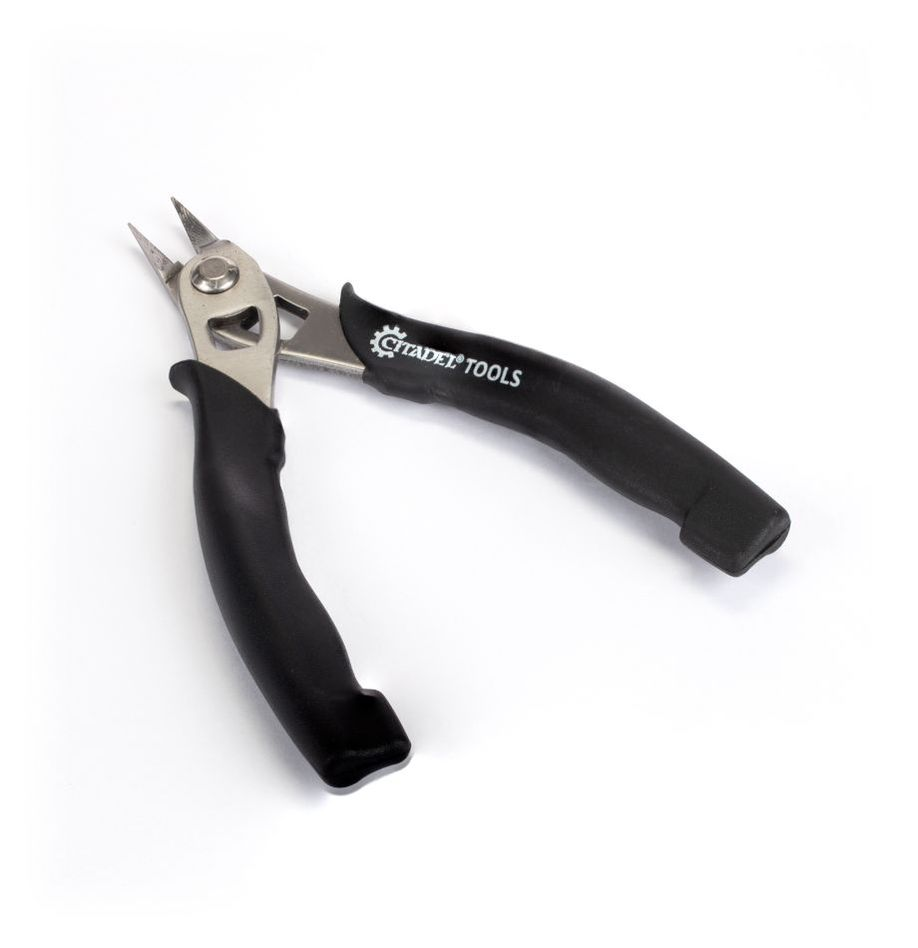
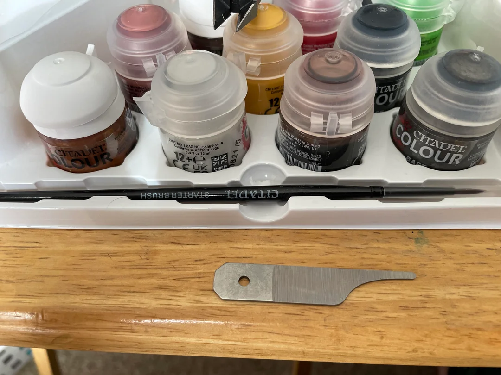
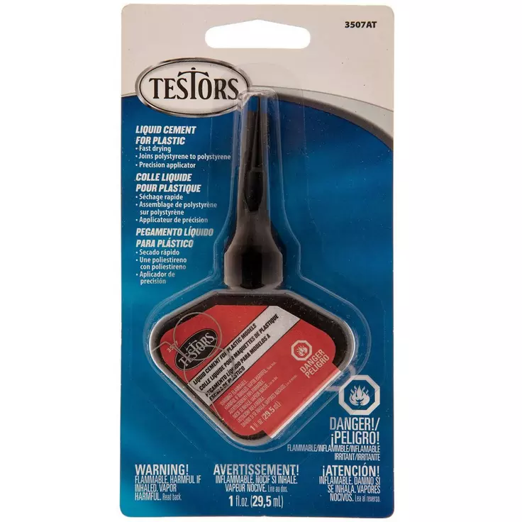
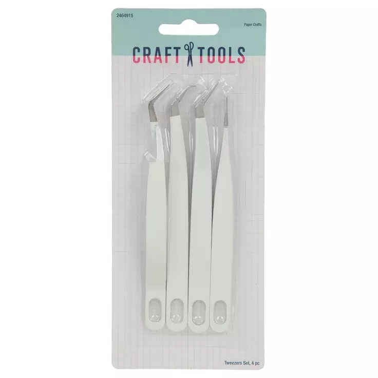
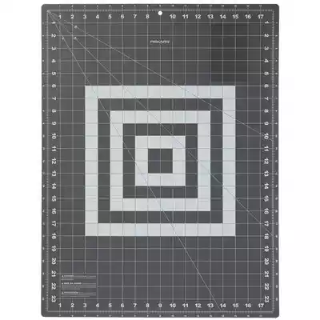
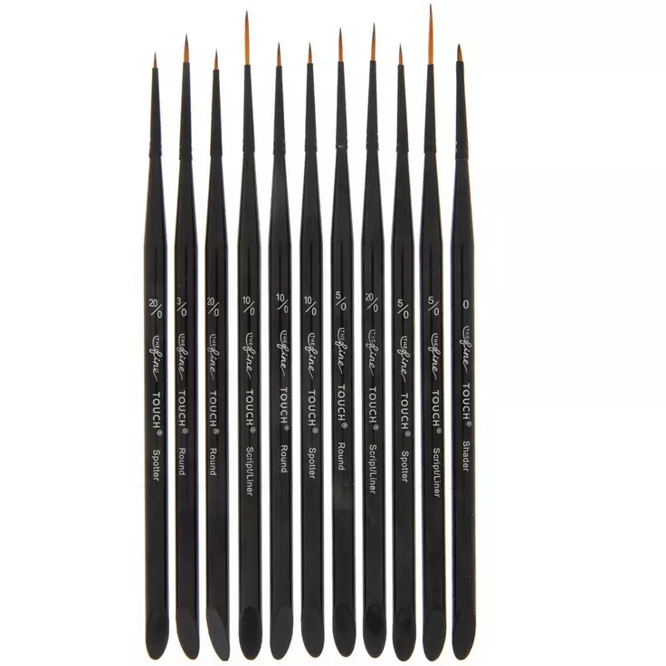

# WarHammer Model Building Supplies

# Contents

- [Plastic Cutters](#plastic-cutters)
- [Mouldline Scraping Tool](#mouldline-scrapping-tool)
- [Glues and Cements](#plastic-glue-or-liquid-cement)
- [Crafting Kit](#tweezers--crafting-tools)
- [Work Mat](#work-mat)
- [Brushes](#brushes)

## Plastic Cutters

Used for removing model parts from their kit's frame.

## Mouldline Scrapping Tool

Used for removing mouldlines on individual parts of the model where they were attached to the starting shell.

## Plastic Glue or Liquid Cement

Used for binding the model parts together

## Tweezers / Crafting Tools

Used for placing parts together with precision

## Work Mat

Used for keeping the table and surroundings clean. Also looks cool.

## Brushes

Used for painting the models, obviously. Brushes of different sizes will most 
likely be needed.

