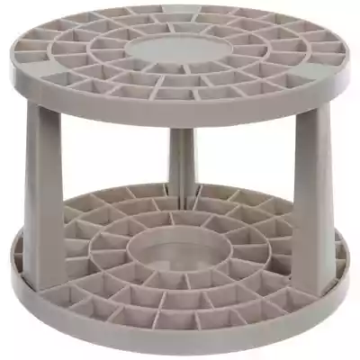
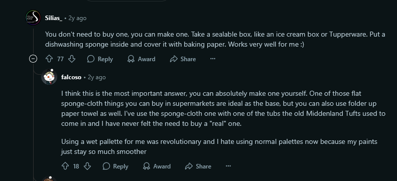
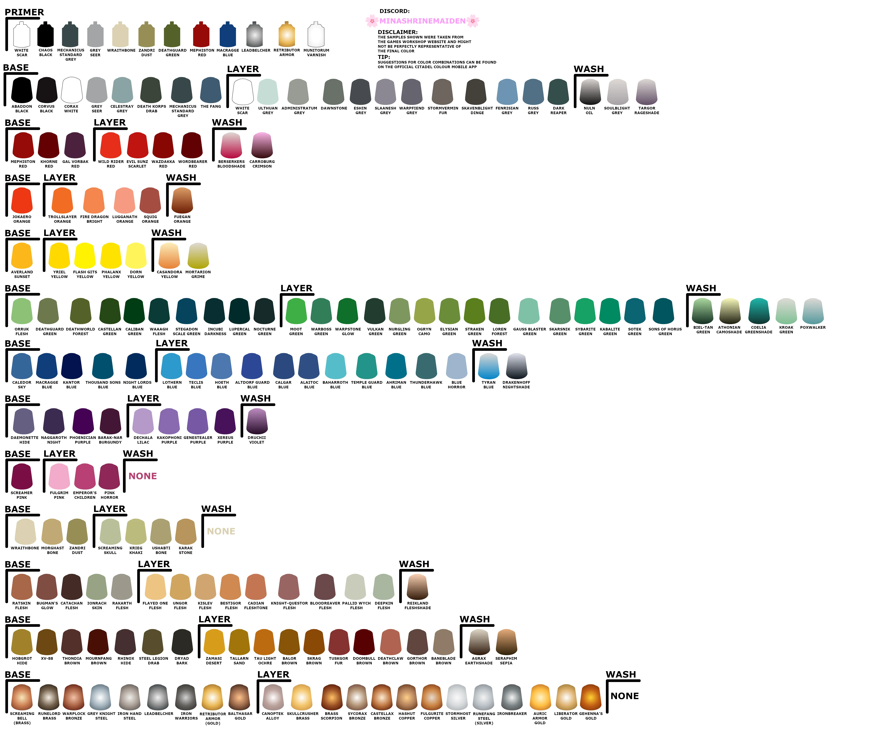

# WarHammer Model Building Supplies

# Contents

- [Plastic Cutters](#plastic-cutters)
- [Mouldline Scraping Tool](#mouldline-scrapping-tool)
- [Glues and Cements](#plastic-glue-or-liquid-cement)
- [Crafting Kit](#tweezers--crafting-tools)
- [Work Mat](#work-mat)
- [Brushes](#brushes)
- [Brush Holder](#brush-holder)
- [Wet Palette](#wet-palette)
- [Paints](#paint)

## Plastic Cutters

Used for removing model parts from their kit's frame.

## Mouldline Scrapping Tool

Used for removing mouldlines on individual parts of the model where they were attached to the starting shell.

## Plastic Glue or Liquid Cement

Used for binding the model parts together.

[Link to Buy](https://www.hobbylobby.com/crafts-hobbies/model-kits/tools-adhesives/liquid-cement-with-applicator/p/952)

## Tweezers / Crafting Tools

Used for placing parts together with precision

[Link to Buy](https://www.hobbylobby.com/scrapbook-paper-crafts/punches-paper-craft-tools/paper-craft-tools/craft-tweezers---4-piece-set/p/81202145)

## Work Mat

Used for keeping the table and surroundings clean. Also looks cool.

[Link to Buy](https://www.hobbylobby.com/fabric-sewing/sewing-quilting-notions/cutting-mats/fiskars-cutting-mat---18-x-24/p/81132369)

## Brushes

Used for painting the models, obviously. Brushes of different sizes will most 
likely be needed. Below are detail brushes.

[Link to Buy](https://www.hobbylobby.com/art-supplies/brushes/art-brush-sets/synthetic-detail-paint-brushes---11-piece-set/p/8935)

## Brush Holder

Used with brushes makes the ultimate organizational combo.

[Link to Brush Holder](https://www.hobbylobby.com/art-supplies/art-storage/art-supply-storage/gray-round-brush-holder/p/80989619)

## Wet Palette

Used to keep paint wet and from drying out. Allows you to resume painting without wasting supplies.

[Reddit Link](https://www.reddit.com/r/Warhammer40k/comments/17qgvli/are_wet_palettes_really_a_must/)

## Paint 

A new take on finger painting. Below are a collection of citadel paint, although 
other brands can probably be used.

[Link to Citadel Paint](https://www.warhammer.com/en-US/plp?search=Paint-sets)

